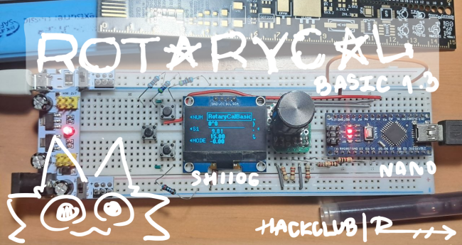
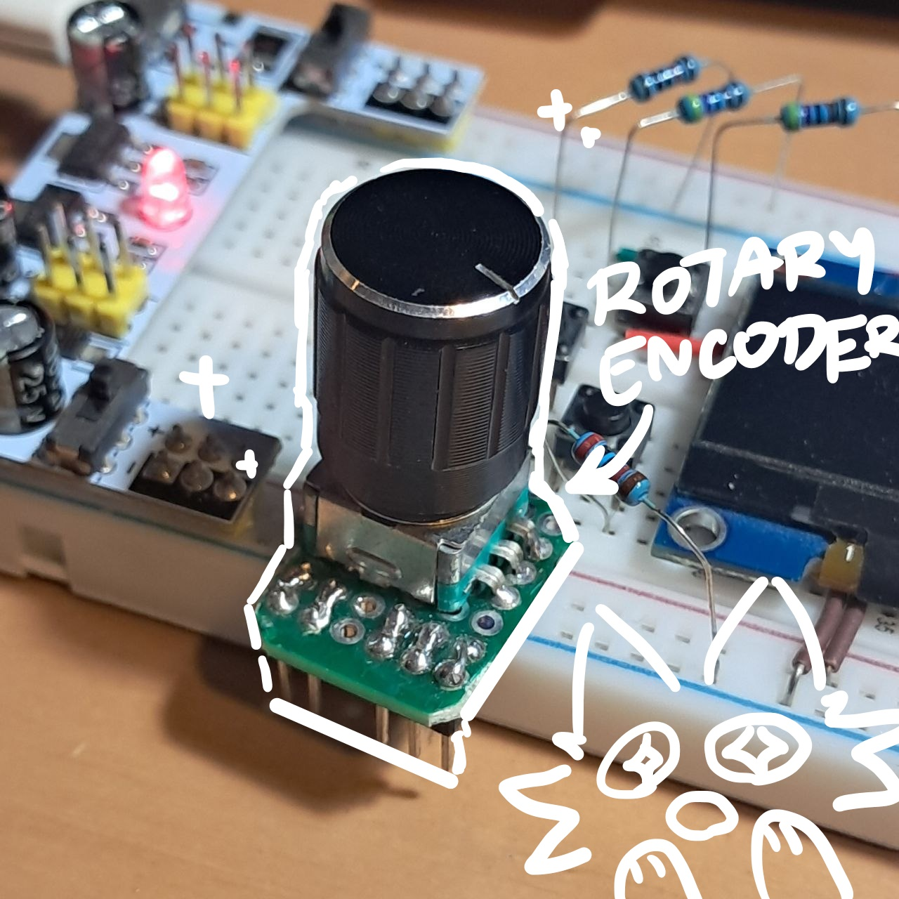
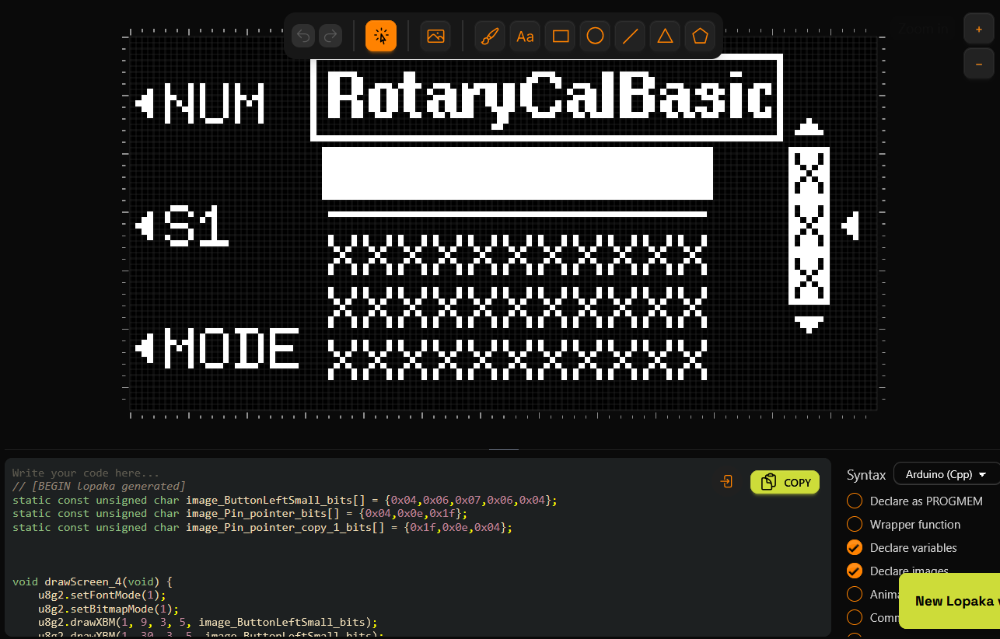
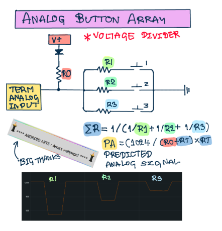
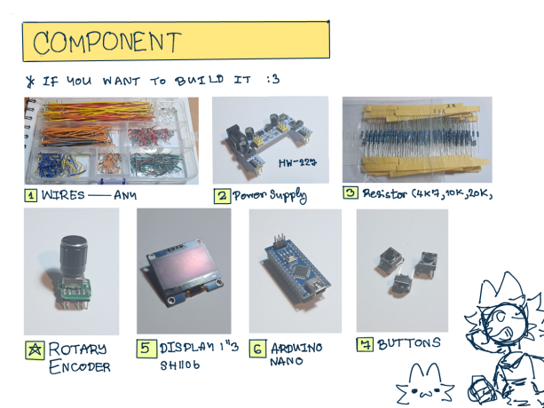
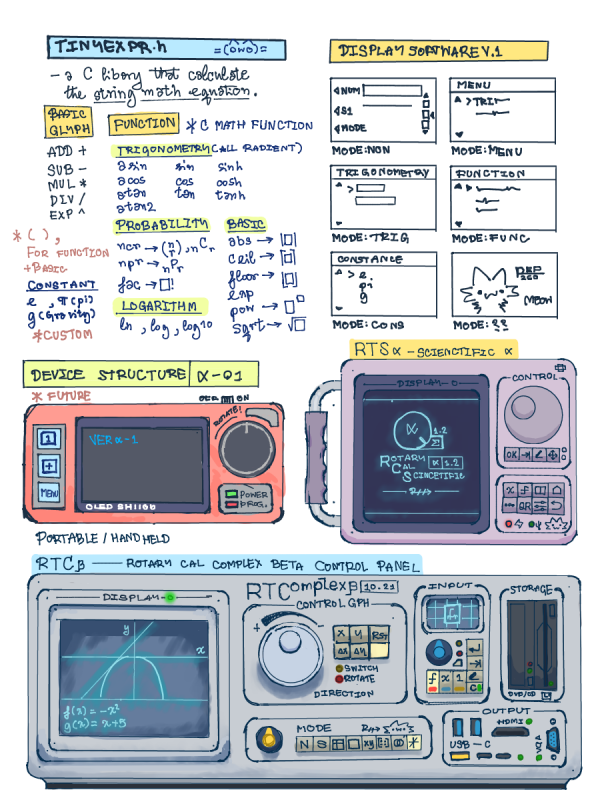
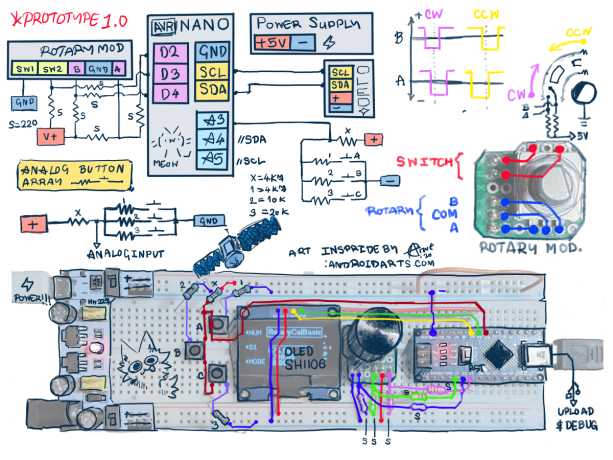
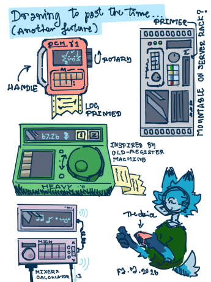

# RotaryCalbasic
The calculator project instead of numpad i just use rotary encoder :3

I always wanted to try the knob (rotary encoder) and I think its now the chance to try it!!!



First I need to understand the concept of the rotary encoder first. (Well because this is the forst time I ever use this)

---- Huge Thanks to [Android art](https://androidarts.com)

---

## Rotary Encoder ** MAIN

When the rotary encoder get rotate, both metal contact under the disk will be touched (IDK what to say) slightly off. When it rotate clockwise the metal B will contact before metal A and t goes in reverse for counter clockwise. So, due to that I wrote this. 
```ino
if (knobmov) { // Check falling on pin A
    if (!knobvalueb) // Check status pin B
        CCW // Contact A when B is not contacted
    else
        CW // Contact A when B is already contacted
}
```
There are several issue in the knob spinning. The microcontroller cant process it quickly enough to compare the input soo there will be some disturbance to the input.


---

## Display

The display system use ["u8g2"](https://github.com/olikraus/u8g2) libary and i use [lopaka](https://lopaka.app) for designing the display :3

PS this part of the code is taking to much memory because i did use fullscreen buffer now i use 1 section buffer.

---

## ButtonArray

Next The Button , now you would ask that how can we reduce the input of the multiple button into 1 single pin ???

There's a method called "[**voltage divider**](https://en.wikipedia.org/wiki/Voltage_divider)" that slove the issue!

The voltage divided so the anaog input can translate the input and then calculate the input.



---

## Math Function\Libary

Most of the time the math s calcuated in the programe but not in string soooo i use the math libary i found. its called "[tinyexpr.h](https://github.com/codeplea/tinyexpr/tree/master)" its a small libary for the math expression progress in string (array of char)

they can do all of the math function in c.

---

## Video demonstration

the video was taken with PC webcam, 8 megapixel no auto focus, on a pcb ruler

this video will explain and demonstrate on how to use the device and explain each part of the calculator (with comparation of the regular calcuator)

<video width="320" height="240" controls>
  <source src="https://youtu.be/KrLcsJHeQHQ" type="video/mp4">
</video>

[](https://www.youtube.com/watch?v=KrLcsJHeQHQ)

---

## Component



---

## Future design



This is the future design for the future design (if i have more supply and more time)

---

This is the short version? 



---

## Extra!

